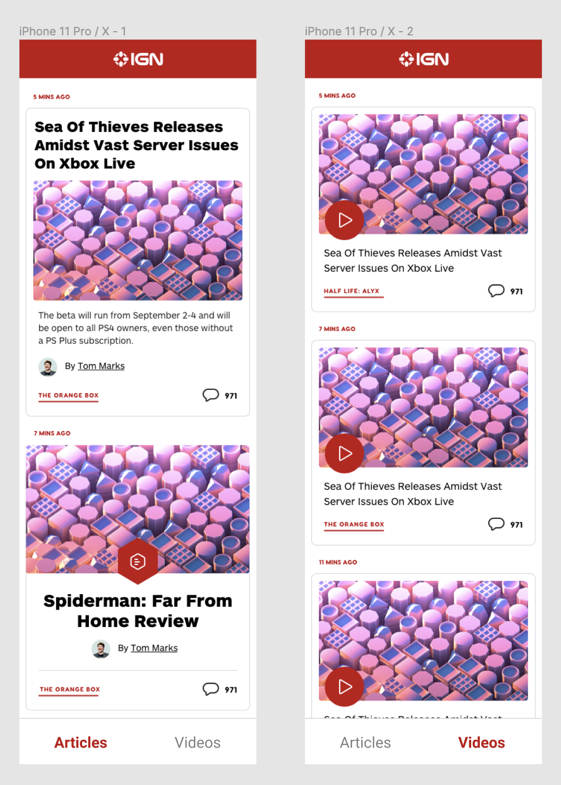

# React Native Challenge

Using the below API, pull a list of content and comment counts.

Base URL - `https://ign-apis.herokuapp.com`

Article Feed Endpoint - `/articles`

Video Feed Endpoint - `/videos`

Comment Count Endpoint - `/comments?ids={comma seperated contentIds}`

This app should display the fetched content and match the general design below as close as possible. (Don’t worry about the icons.)

Each list item should open a webview for the corresponding content on ign.com when tapped (except comments).

Optional API Pagination Parameters:

- startIndex: The index of the first record to return in the response. Default is 0, min is 0, max is 300
- count: The number of records to return in the response. Default is 10, min is 1, max is 20.

Sample Paginated Request: `https://ign-apis.herokuapp.com/articles?startIndex=30&count=5`
